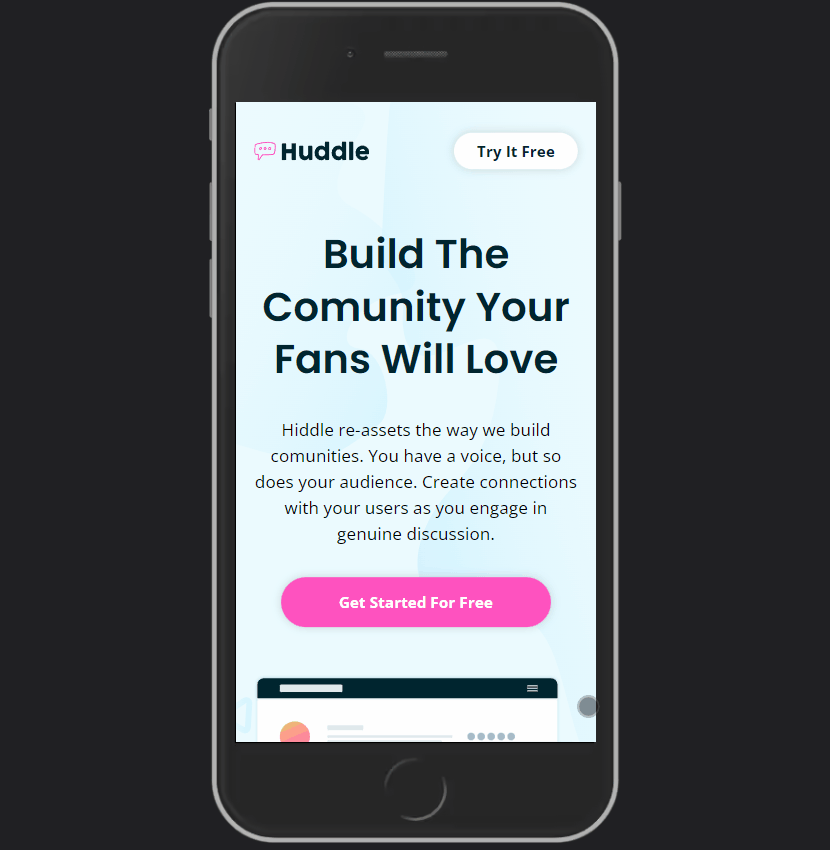

# Huddle Landing Page - Frontend Mentor

This is a solution to the [Huddle landing page challenge on Frontend Mentor](https://www.frontendmentor.io/challenges/huddle-landing-page-with-alternating-feature-blocks-5ca5f5981e82137ec91a5100), built with React JS and Styled Components.

This project was bootstrapped with [Create React App](https://github.com/facebook/create-react-app).

## 🛠️ Technologies

- [React](https://reactjs.org/)
- [Styled Components](https://styled-components.com/)
- [React Icons](https://react-icons.github.io/react-icons)

## 🔗 Link

- Live Site URL: [Huddle Landing Page](https://huddle-landing-page-julianachagas.netlify.app/)

## 💻 Overview

### The challenge

Users should be able to:

- View the optimal layout for the site depending on their device's screen size
- See hover states for all interactive elements on the page

### Preview

- Web
   <br/><br/>

- Mobile

   <br/><br/>

## ⚙️ How to use

To clone and run this project you'll need [Node.js](https://nodejs.org/en/) and [Git](https://git-scm.com) installed on your computer. In addition, it is good to have an editor to work with the code like [VSCode](https://code.visualstudio.com/). Follow the instructions bellow:

```bash
# Clone this repository
$ git clone https://github.com/julianachagas/huddle-landing-page.git

# Go into the repository
$ cd huddle-landing-page

# Install the dependencies
$ npm install

# Run the app in development mode
# Open http://localhost:3000 to view it in your browser
$ npm start

# Build the app for production to the `build` folder
# It correctly bundles React in production mode and optimizes the build for the best performance.
$ npm run build

```

## 📚 Useful resources

- [Styled Components Crash Course](https://youtu.be/02zO0hZmwnw) by Brad Traversy

## 👩🏻‍💻 Author

<a href="https://www.linkedin.com/in/juliana--chagas/" target="_blank"></a>
<a href="https://twitter.com/JulianaCoding" target="_blank"></a>

---

##### Made with 💜 by Juliana Chagas
